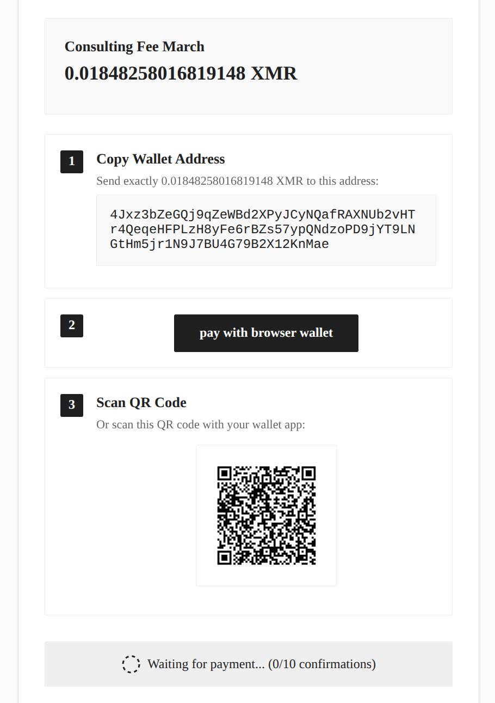

# Monero Payment Links
This Bun server creates checkout pages with Monero QR codes and a dashboard to manage wallets and payment links.



 Full operator guide: [docs/payment-links.md](docs/payment-links.md).

```bash
bun install
bun run dev          # hot reload on http://localhost:3003
bun run production   # production mode
```

### code overview 
`server.ts` sets routes. `checkout.ts` renders payment pages. `db.ts` stores sessions and links in SQLite (`monero_payments.db`).

`dashboard/` contains login, payment-link admin dashboard CRUD, and wallet APIs. `ws.ts` pushes live updates to dashboard. `rates.ts` converts fiat. `theme/` sets style (edit this yourself & add more themes). `wallet-caches/` stores scan files.


### deployment
provides automatic HTTPS and restart

prerequisites: public DNS `A` record pointing to the server, TCP `80,443` open.

1. install runtime and web server:
```bash
curl -fsSL https://bun.sh/install | bash
# install Caddy per https://caddyserver.com/docs/install#debian-ubuntu-raspbian
```

2. install app:
```bash
git clone <repo-url> /opt/monero-payment-links
cd /opt/monero-payment-links
bun install
```

3. run as a service, /etc/systemd/system/monero-payment-links.service:
```ini
[Unit]
Description=Monero Payment Links
After=network-online.target
Wants=network-online.target

[Service]
WorkingDirectory=/opt/monero-payment-links
ExecStart=/root/.bun/bin/bun run server.ts
Environment=NODE_ENV=production
Environment=PATH=/root/.bun/bin:/usr/local/sbin:/usr/local/bin:/usr/sbin:/usr/bin:/sbin:/bin
Restart=always
RestartSec=3

[Install]
WantedBy=multi-user.target
```

```bash
systemctl daemon-reload
systemctl enable --now monero-payment-links
```

4. reverse proxy with automatic TLS, /etc/caddy/Caddyfile:
```
<domain> {
  reverse_proxy 127.0.0.1:3003
}
```

```bash
caddy validate --config /etc/caddy/Caddyfile --adapter caddyfile
systemctl reload caddy
```

5. retrieve ADMIN_SECRET from /opt/monero-payment-links/.env after first login attempt and sign in at `https://<domain>/login`.
